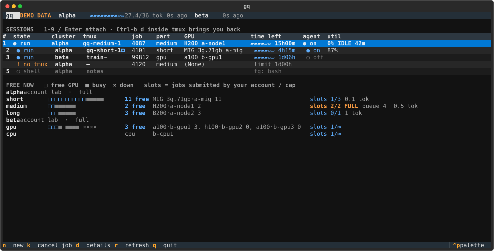
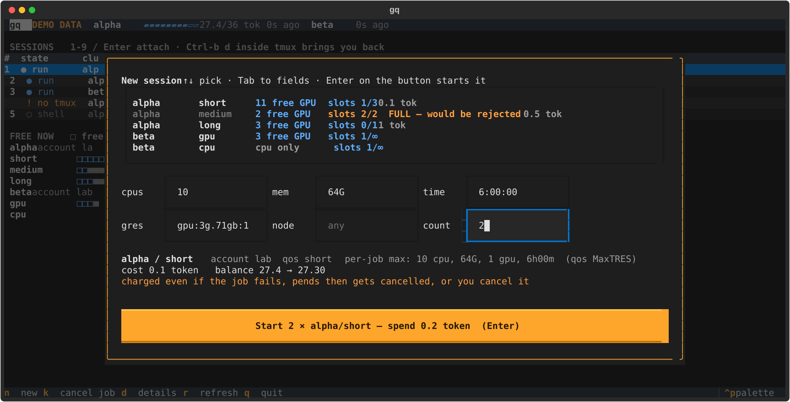

# gq

**Interactive GPU sessions on Slurm clusters, one keypress away.**
gq keeps each `srun --pty bash` alive inside tmux on the cluster's login node and gives you one
dashboard across all your clusters. It shows which session is on which cluster, how much time each has
left, and what is free right now. Press `1`–`9` to jump into a session and `Ctrl-b d` to come back.



- **No more ssh → tmux → srun by hand.** Start one session or several from the dashboard (`n`) or with
  `gq new`. Close your laptop and the sessions keep running.
- **Sees what is free.** Free GPUs per node and type, down nodes, and your account's job caps
  (`slots 2/2 FULL`) are all read from Slurm. gq refuses to submit a job the cluster would reject.
- **Learns each cluster by itself.** gq reads your account, partitions, QoS limits, GPU and MIG types,
  wall times and optional per-job costs from Slurm. You write no cluster config by hand.
- **Lets coding agents use an allocation you already hold.** `gq run` executes commands inside your
  running session: no new jobs, nothing typed into your shell, bounded waits and short log output.

> **Cluster rules:** gq never runs compute on the login node. There it only runs read-only Slurm queries
> (`scontrol`, `sacctmgr`, `squeue`), `tmux` and `ps`, at most once every 30 s per open dashboard.
> Everything you run executes on a compute node inside an allocation. See [FAQ](docs/TROUBLESHOOTING.md#faq).

## Requirements

| where | what |
|---|---|
| your laptop | Linux or macOS, Python ≥ 3.9, `ssh` with key login to each cluster |
| cluster login node | Slurm client tools, `tmux`, `python3` ≥ 3.6 (nothing to install by hand: gq deploys itself into `~/.gq`) |

## Install (one minute)

```bash
uv tool install git+https://github.com/thesvj/gq      # or: pipx install git+https://github.com/thesvj/gq
gq setup        # asks for a cluster name and its ssh host, deploys, shows what it discovered
gq              # open the dashboard
```

`gq setup` only needs an ssh host that logs in without a password. If you type
`ssh mycluster` today, the host is `mycluster`. Want to look around first? `gq demo` opens the
dashboard on made-up data and needs no cluster.

Optional extras:

```bash
gq install-shortcut   # app-menu entry, plus Super+G on GNOME (other desktops: bind `gq ui` yourself)
gq install-hook       # Claude Code guard: agents must ask before anything that creates Slurm jobs
gq doctor             # checks ssh, slurm, tmux, python on every cluster and prints a fix for each failure
```

## Daily use

| key | in the dashboard |
|---|---|
| `1`–`9` / `Enter` | attach to that session (the window title shows cluster · session) |
| `Ctrl-b d` | (inside tmux) detach: the job keeps running and you are back in the dashboard |
| `n` | new session(s): pick cluster/partition, adjust cpus/mem/time/gres/node/**count**, press the button |
| `k`, then `y` | cancel the selected job (any other key aborts) |
| `d` | details: the exact srun line, node, limits, the agent runner, recent agent runs |
| `r` / `q` | refresh / quit |

Row marks: `~` means a session you started by hand, matched to its job by srun start time.
`⧉` means attached somewhere else. `! no tmux` is a job with no session to return to.
`IDLE 42m` means the agent runner saw 0 % GPU use for 42 minutes.

From the shell:

```bash
gq ls                                    # the same information as plain text
gq new mycluster short                   # one session (asks you to confirm, then attaches)
gq new mycluster short -n 3              # three sessions in one go, one confirmation
gq new a:short:2 b:long:1                # several clusters/partitions at once
gq new mycluster gpu --mem 64G --cpus 8 --time 4:00:00 --gres gpu:a100:1
gq attach mycluster gq-short-1
gq cancel mycluster gq-short-1
```



Request sizes start from what gq discovers as the per-job maximum. The default `policy = half`
requests half of that; `policy = max` requests all of it. You can override per partition. See
[docs/CONFIG.md](docs/CONFIG.md).

## Coding agents (Claude Code, Codex, …)

Agents that start their own jobs waste allocations and quota. With gq, a human starts the session and
agents work inside it:

```bash
gq ls                                             # find a session whose agent column says ● on
gq run mycluster:gq-short-1 -C ~/proj -- 'python train.py --steps 100'   # prints a run id
gq wait mycluster <id>        # blocks up to 9 min; exit 75 = still running (call again)
gq tail mycluster <id> 40 'loss|error'           # ≤ 4 KB, progress bars and colour codes removed
gq stop mycluster <id>
```

The agent runner is opt-in (`agents = true` in the config). Inside agent runs, `sbatch` and `salloc`
are blocked. Copy [docs/AGENTS_SNIPPET.md](docs/AGENTS_SNIPPET.md) into your `CLAUDE.md` / `AGENTS.md`.
The optional Claude Code hook is a guardrail against accidents, **not** a security boundary. Its limits
are described in [docs/ARCHITECTURE.md](docs/ARCHITECTURE.md#security-model).

## Works on any Slurm cluster

gq has been run on two Slurm 24.05 clusters with MIG and full-GPU partitions and per-job token
accounting. Its tests cover synthetic sites with several accounts, partitions without QoS, `AllowQos`
lists, per-user-only limits, typed GPUs and drained nodes. Where something cannot be discovered (for
example, `sacctmgr` access is blocked), gq says so and you set it in the config.
[docs/CONFIG.md](docs/CONFIG.md) covers adding a cluster, per-partition overrides, and plugging in a
site's own cost or quota system.

## Documentation

- [docs/CONFIG.md](docs/CONFIG.md): config reference, adding a cluster, cost/quota providers
- [docs/ARCHITECTURE.md](docs/ARCHITECTURE.md): how it works, files on the cluster, security model, agent runner
- [docs/TROUBLESHOOTING.md](docs/TROUBLESHOOTING.md): common problems and the FAQ ("does this break cluster rules?")
- [CONTRIBUTING.md](CONTRIBUTING.md) · [SECURITY.md](SECURITY.md)

## Uninstall

```bash
gq uninstall          # dry run: lists what would be removed (local config/cache, ~/.gq on clusters, hook)
gq uninstall --yes    # do it (keeps ~/.gq on a cluster while an allocation still uses it)
uv tool uninstall gq  # or: pipx uninstall gq
```

## License

MIT
